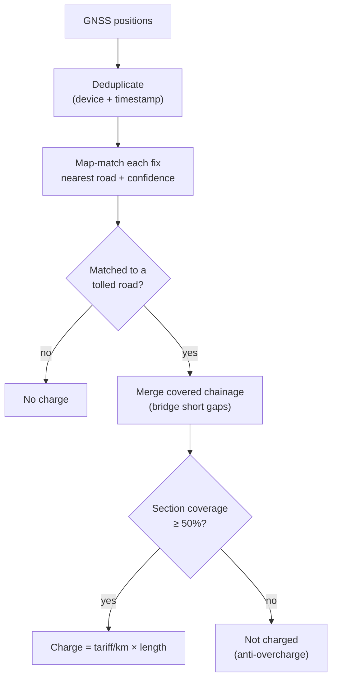

# gnss-section-tolling-engine

A **GNSS section-based (distance) tolling engine**: it ingests a stream of GNSS
position reports from an on-board unit, **map-matches** each fix to a road
network, works out which **tolled sections** the vehicle actually traversed, and
rates the trip by distance. It bridges positioning gaps (tunnels), refuses to
charge a vehicle on the parallel untolled road, and applies an **anti-overcharge**
rule so a brief graze at a ramp never raises a charge.

This is a different tolling paradigm from point-based MLFF and zone-based cordon
pricing — here the charge follows *distance travelled on tolled links*.

Zero third-party dependencies. Standard library + `pytest` only. The demo is a
single self-contained HTML file with a live map-matching view.

## 30-second tour

| You want to… | Look at | What it tells you |
|---|---|---|
| Watch matching happen | Map view | GNSS fixes snapped to the tolled mainline or untolled service road, vehicle rating live |
| Read the trip | Trip KPIs | Total charge, matched road, matched fixes, low-confidence count |
| See the rating | Section charges | Coverage, distance and outcome per tolled section |
| Understand the call | Assistant | Priority, headline, actions, and the trace behind them |
| Stress-test it | Scenario buttons | Tunnel gap, ramp graze, poor GPS |

## How a trip is rated



## Domain rules, in brief

- **Confidence gates the charge.** A fix is matched only if it is close to a road
  and its GNSS accuracy is good; a fix midway between two roads is *ambiguous* and
  its confidence is halved. Below the floor it is not used — better unrated than
  charged to the wrong road.
- **Gaps are bridged.** Consecutive matched fixes with a gap up to 2.5 km are
  treated as one continuous drive, so a tunnel does not split a trip or drop a
  section.
- **Coverage decides the section.** A section is charged only if the vehicle
  traversed at least half of it; a ramp graze below that threshold is excluded.
- **Distance is the charge.** Each charged section bills its per-kilometre tariff
  across its length.
- **The parallel road is safe.** A vehicle on the untolled service road matches
  the service road and is never charged for the mainline.

## Run it

```bash
open demo/index.html          # the interactive map-matching console
python3 -m pytest -q          # domain-claim tests
./check-sources.sh            # zero-dep + leak + self-contained + tests gate
```

## Layout

```
gnss_tolling/    geo, network, match, trip, assistant, scenarios
tests/           domain claims (pytest)
demo/index.html  self-contained animated dashboard
check-sources.sh CI gate: zero-dep + leak + self-contained + tests
```

## License

MIT — see [LICENSE](LICENSE).
